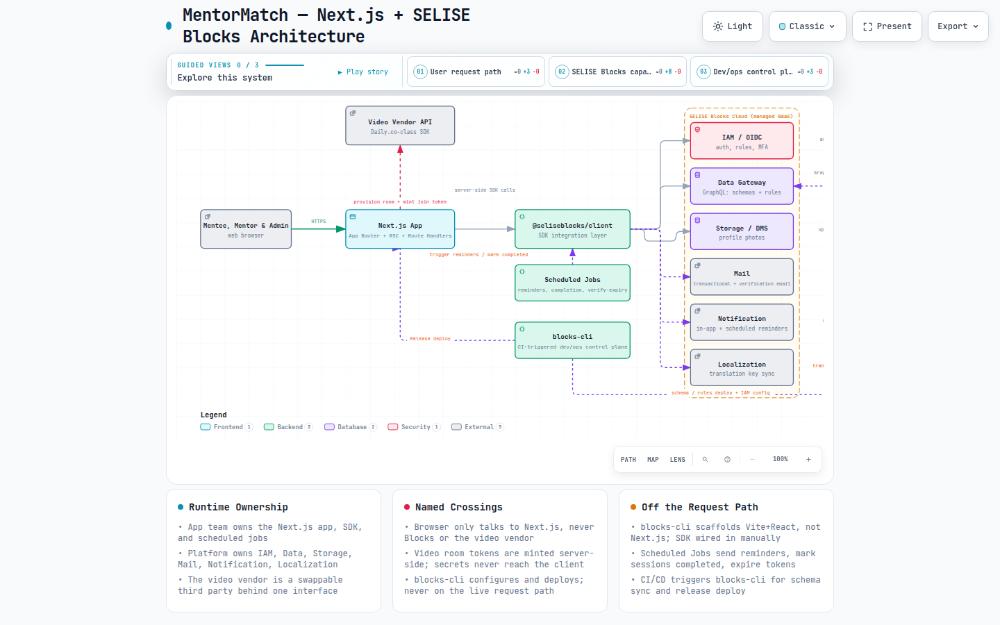

# MentorMatch — Planning Report

**An ADPList-style mentorship marketplace, scoped as staff-engineer-level planning documentation. No application code was written — this report and its companions are the deliverable, per the request.**

Date: 2026-09-13 · Status: Ready for stakeholder review

---

## 1. What's in this folder

| File | Contents |
|---|---|
| [`01-BRD.md`](./01-BRD.md) | Business Requirements Document — vision, goals, stakeholders, in/out of scope, success metrics, risks, post-MVP roadmap |
| [`02-REQUIREMENTS.md`](./02-REQUIREMENTS.md) | Functional Requirements (32 FRs across 7 domains) and Non-Functional Requirements (20 NFRs across 7 quality attributes) |
| [`03-ARCHITECTURE.md`](./03-ARCHITECTURE.md) | Next.js + SELISE Blocks architecture: layers, SDK wiring, data model, booking sequence, deployment topology |
| [`04-DESIGN-SYSTEM.md`](./04-DESIGN-SYSTEM.md) | Original design system ("Corner") — tokens, components, layout principles, voice, accessibility baseline |
| [`05-BLOCKS-CLI-ANALYSIS.md`](./05-BLOCKS-CLI-ANALYSIS.md) | Capability-by-capability analysis of `blocks-cli` (`@seliseblocks/cli-os`) against every requirement, including the one verified gap |
| [`diagrams/mentormatch-architecture.html`](./diagrams/mentormatch-architecture.html) | Interactive Archify architecture diagram (open in a browser) — pan/zoom, guided views, search |
| [`diagrams/mentormatch-architecture.architecture.json`](./diagrams/mentormatch-architecture.architecture.json) | Source spec for the diagram above |

## 2. Research inputs (checked before writing anything)

1. **adplist.org** — fetched live. Confirmed: 36,000+ mentors, 400,000+ members, 160+ countries; free-first model with one included session; mentor directory with rating/review/session-count trust signals; recorded sessions with transcription/summary (per Trustpilot reviews); community meetups; career categories spanning design/product/eng/marketing/data.
2. **`blocks-cli`** — two candidates existed under that name; the correct one for this workspace was determined by direct inspection, not assumption:
   - `@blocks-network/cli` (npm, "Blocks Network" / blocks.ai) — an **unrelated** AI-agent-marketplace CLI. Ruled out.
   - `@seliseblocks/cli-os` — found locally at `../blocks-cli/blocks-cli`, a SELISE Blocks BaaS control-plane CLI. **This is the one used throughout this report**, confirmed via its `package.json`, `AI_START_GUIDE.md`, `AGENTS.md`, and command source (`src/commands/*`, `src/lib/scaffold-web/*`).

## 3. The seven scope decisions you made (and why they matter)

| Decision | Choice | Downstream effect |
|---|---|---|
| MVP scope | Core marketplace only | BRD §6/§7 draws a hard line: no communities, no enterprise, no payments, no mobile app in v1 |
| Video | 3rd-party SDK | NFR-18 isolates it behind one interface; no WebRTC infra to build/operate |
| Auth | SELISE Blocks IAM/OIDC | Role model (mentee/mentor/admin) and MFA come "for free" from the platform |
| Framework | Next.js, SDK wired manually | Directly caused the most important architectural finding — see §4 below |
| Payments | None at MVP | Removes an entire compliance/KYC workstream from v1 |
| Deployment | SELISE Blocks Cloud | Release module reused, no new hosting relationship to stand up |
| Design direction | Original, ADPList-inspired | `04-DESIGN-SYSTEM.md` is a fresh token system, not a skin of an existing brand |

## 4. The single most important finding

**`blocks-cli`'s own scaffolder (`blocks new web`) generates Vite + React, not Next.js.** This was verified by reading the actual scaffolder source (`src/lib/scaffold-web/`), not inferred from documentation. It means "Next.js + blocks-cli" is not a zero-cost combination — it requires manually wiring `@seliseblocks/client` into a hand-created Next.js app (documented step-by-step in `03-ARCHITECTURE.md` §4). This is a one-time cost, isolated to a handful of files under `lib/blocks/`, and every other CLI capability (Data, IAM, Storage, Mail, Notification, Release) works identically regardless of frontend framework. Full analysis in `05-BLOCKS-CLI-ANALYSIS.md` §3.

## 5. Architecture at a glance



*(Open [`diagrams/mentormatch-architecture.html`](./diagrams/mentormatch-architecture.html) directly in a browser for the interactive version — pan/zoom, three guided views: "User request path", "SELISE Blocks capabilities", "Dev/ops control plane". This is the full 12-node picture: it also shows the async **Scheduled Jobs** worker (reminders, session completion, company-verification token expiry) and **Localization** as a sixth managed Blocks capability, alongside the five already covered.)*

In one sentence: **the browser only ever talks to the Next.js app; the Next.js app and its Scheduled Jobs worker are the only things that talk to SELISE Blocks (via the SDK) and to the video vendor; `blocks-cli` configures and deploys but never sits on the live request path.**

## 6. How to grow this into the full ADPList feature set

This is the direct answer to "then how we can improve to add new feature" — a sequenced roadmap, not a wishlist. Each phase builds on data/infrastructure the previous phase already created, so nothing here requires re-architecting the MVP.

```
MVP (this report)
  └─ core marketplace: profiles, search, booking, video, reviews
       │
       ├─ v1.1  Reminders via SMS/push + .ics calendar sync
       │         → reuses the Notification module already wired for email reminders (FR-26)
       │
       ├─ v1.2  Session recording + AI transcription/summary
       │         → ADPList's most-cited review differentiator; needs a recording-capable
       │           video vendor (check the chosen SDK supports it) + a Storage pipeline
       │           for the recording/transcript, which the Storage/DMS module already provides
       │
       ├─ v1.3  AI-assisted mentor matching
       │         → needs real mentor/session data first (cold-start problem from BRD §11);
       │           becomes a recommendation layer over the existing MentorProfile/Session schemas,
       │           not a new data model
       │
       ├─ v2.0  Communities & events (group sessions, meetups)
       │         → new many-to-many membership schema, separate from the 1:1 Session model;
       │           biggest net-new engineering investment on this list
       │
       ├─ v2.1  Paid sessions (Stripe Connect)
       │         → adds KYC/payout/refund flows; the Session state machine (FR-17) already has
       │           the right shape to add a payment-state dimension without redesign
       │
       ├─ v2.2  Enterprise/B2B (company-sponsored programs, seats, admin dashboards)
       │         → new buyer, new data model (org → seats → mentors); build only once
       │           the core marketplace has proven liquidity (BRD success metrics)
       │
       ├─ v2.3  Native mobile apps
       │         → only once web retention justifies the investment
       │
       └─ v3.0  Public content hub / jobs board
                 → marketing/growth surface; can be a separate CMS-driven microsite,
                   doesn't touch the core Data schemas at all
```

**Why this order:** each phase either (a) reuses infrastructure the MVP already stood up (reminders, recording, matching), or (b) is deliberately isolated as new infrastructure so it can't destabilize the core loop while it's proven (communities, payments, enterprise). This mirrors how ADPList itself appears to have grown — free 1:1 sessions first, trust signals and recording next, communities/enterprise layered on top of an already-liquid marketplace.

## 7. Explicitly not done in this report (by design)

- No application code, no Figma mockups, no Next.js project scaffold. The instruction was "don't need to write code — just give me BRD" plus the supporting planning artifacts.
- No `/design-flow` interview loop was run interactively; `04-DESIGN-SYSTEM.md` delivers the same output (tokens → structure → component contracts) as a single document, since the request was for a report rather than a live design session. If you want the interactive version — grill-me → design-brief → information-architecture → design-tokens → brief-to-tasks → frontend-design — say so and it can be run as a follow-up, using this BRD as the seed input.
- No `/writing-plans`-style task-by-task implementation plan was generated, since "don't write code" implies implementation isn't starting yet. Once this BRD/architecture is approved, the natural next step (per the attached `writing-plans` skill) is to turn `02-REQUIREMENTS.md` + `03-ARCHITECTURE.md` into a bite-sized, TDD-oriented implementation plan — that's a distinct, approval-gated next step, not bundled into this planning report.

## 8. Suggested next step

Review `01-BRD.md` and `02-REQUIREMENTS.md` first (they drive everything downstream). If the MVP scope and the seven confirmed decisions still look right after reading the full detail, the next artifact to request is an implementation plan (via `writing-plans`) for Phase 1 of the roadmap in §6 — the core marketplace itself.
